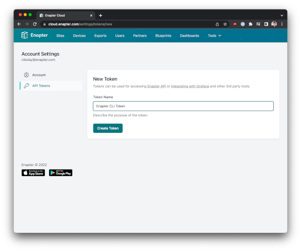
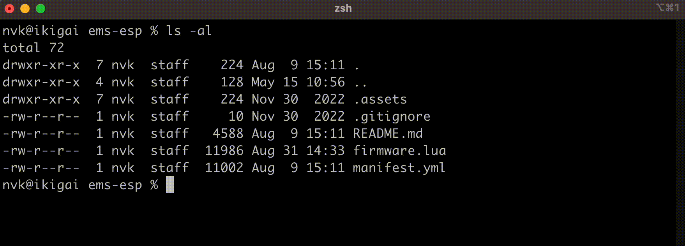

# Enapter CLI

[](/LICENSE)
[](https://github.com/enapter/enapter-cli/releases/latest)


This tool helps Enapter customers to work with devices. It useful in the following cases:
1. Develop devices via blueprints.
2. Update and monitor devices.

## How to install

###  macOS - recommended

```bash
brew tap enapter/tap && brew install enapter
```

### Get prebuilt binaries

Choose your platform and required release on the [Releases page](https://github.com/Enapter/enapter-cli/releases).

### Build from source

You should have [installed Go tools](https://golang.org/doc/install). Then you can build CLI via the following command:
```
./build.sh
```

Also you can pass custom output path:
```
./build.sh /usr/local/bin/enapter
```

## How to use

### API token

Enapter CLI requires access token for authentication. Obtaining of the token is easy and can be done by following few steps.

1. Ensure you have registed [Enapter Cloud](https://cloud.enapter.com) account. If not, sign up [here](https://sso.enapter.com/users/new).
2. Log in to your Enapter Cloud account, click on your profile name in top right corner and choose `Account Settings`
3. Select `API Tokens` menu and click `New Token` button
4. Follow the instructions on the screen


5. Set environment variable `ENAPTER_API_TOKEN` with new token. To make it permanent don't forget to add it to configuration files of your shell.

  ```bash
  export ENAPTER_API_TOKEN="your token"
  ```

Please note that if you don't save your token, it is not possible to reveal it anymore. You need generate new token.

### Autocompletion in your favourite terminal app

In order to make life easier with command line interface, you may use [Fig - the next-generation command line](https://fig.io/). This autocompletion tool has native support for the Enapter CLI for Mac OS X and Linux.

