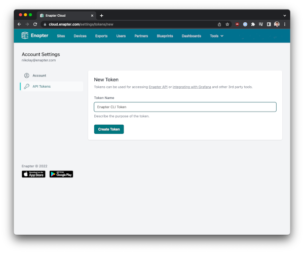
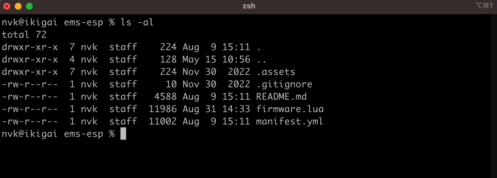

# Enapter CLI

[](/LICENSE)
[](https://github.com/enapter/enapter-cli/releases/latest)

## Overview

The Enapter CLI is a command-line interface tool for managing Enapter services, including sites, devices, blueprints, and the rule engine. It provides a comprehensive set of commands for interacting with the Enapter Cloud platform and Gateway devices.

This tool helps Enapter customers to work with devices it is alternative for [Enapter IDE for EMS Toolkit 3.0](https://marketplace.visualstudio.com/items?itemName=Enapter.enapter-ems-toolkit-ide).

It helpful in the following cases:

1. Managing all your EMS setup as a code with Git and Ansible / Puppet
2. Establishing CI/CD workflow
3. Development and debugging of Enapter Blueprints
4. Development and debugging of Enapter Gateway Rules

## How to install

###  macOS - recommended

Version 1:

```bash
brew tap enapter/tap && brew install enapter
```

Version 3:

```bash
brew tap enapter/tap && brew install enapter@3
```

## How to upgrade

###  macOS - recommended

Version 1:

```bash
brew upgrade enapter
```

Version 3:

```bash
brew upgrade enapter@3
```

### Get prebuilt binaries

Choose your platform and required release on the [Releases page](https://github.com/Enapter/enapter-cli/releases).

### Build from source

You should have [installed Go tools](https://golang.org/doc/install). Then you can build CLI via the following command:
```
./build.sh
```

Also you can pass custom output path:
```
./build.sh /usr/local/bin/enapter
```

## How to use Version 1:

> [!NOTE]
> Version 1 works only with Enapter Cloud connection.

### API token

Enapter CLI requires access token for authentication. Obtaining of the token is easy and can be done by following few steps.

1. Ensure you have registed [Enapter Cloud](https://cloud.enapter.com) account. If not, sign up [here](https://sso.enapter.com/users/new).
2. Log in to your Enapter Cloud account, click on your profile name in top right corner and choose `Account Settings`
3. Select `API Tokens` menu and click `New Token` button
4. Follow the instructions on the screen


5. Set environment variable `ENAPTER_API_TOKEN` with new token. To make it permanent don't forget to add it to configuration files of your shell.

  ```bash
  export ENAPTER_API_TOKEN="your token"
  ```

Please note that if you don't save your token, it is not possible to reveal it anymore. You need generate new token.

## How to use Version 3:

### Authentication

The Enapter CLI requires an access token for authentication. You can obtain your access token from your Enapter Cloud account settings at [Enapter Cloud](https://cloud.enapter.com).

### Setting Up Your First Enapter Cloud Connection

The recommended way to use the Enapter CLI is by setting up named connections. This approach allows you to:
- Manage multiple environments (production, staging, development)
- Switch between Enapter Cloud and Gateway connections easily
- Associate connections with specific sites
- Store configuration securely

**Step 1: Add a connection**

```bash
enapter connection add --name my-cloud --token YOUR_ACCESS_TOKEN
```

**Step 2: Set it as default (optional)**

```bash
enapter connection set-default --name my-cloud
```

**Step 3: Verify the connection**

```bash
enapter connection list
```

### Quick Start Examples

Once your connection is set up, you can start managing your Enapter resources:

**For Enapter Cloud connections:**

```bash
# List all sites
enapter site list

# List all devices for a specific site
enapter device list --site-id SITE_ID

# Get device information
enapter device get --site-id SITE_ID --device-id DEVICE_ID

# Upload a blueprint (from file or directory)
enapter blueprint upload --path ./my-blueprint.enbp
# or
enapter blueprint upload --path ./my-blueprint/

# Create a new Lua device
enapter device create lua-device \
  --site-id SITE_ID \
  --runtime-id UCM_DEVICE_ID \
  --device-name "My Device" \
  --device-slug my-device \
  --blueprint-path ./blueprint/  # or ./blueprint.enbp
```

### Autocompletion in your favourite terminal app

> [!NOTE]
> Available for Version 1 now.
>
> For Version 3. Please follow enable `Dev mode` and use [https://github.com/nkrasko/autocomplete](https://github.com/nkrasko/autocomplete) repository until merge request is accepted.

In order to make life easier with command line interface, you may use [Kiro CLI](https://kiro.dev/cli/). This autocompletion tool has native support for the Enapter CLI for Mac OS X and Linux.



### Documentation

You can find extended documentation in [Enapter CLI 3 Referecnce](./enapter-cli-3-reference.md)